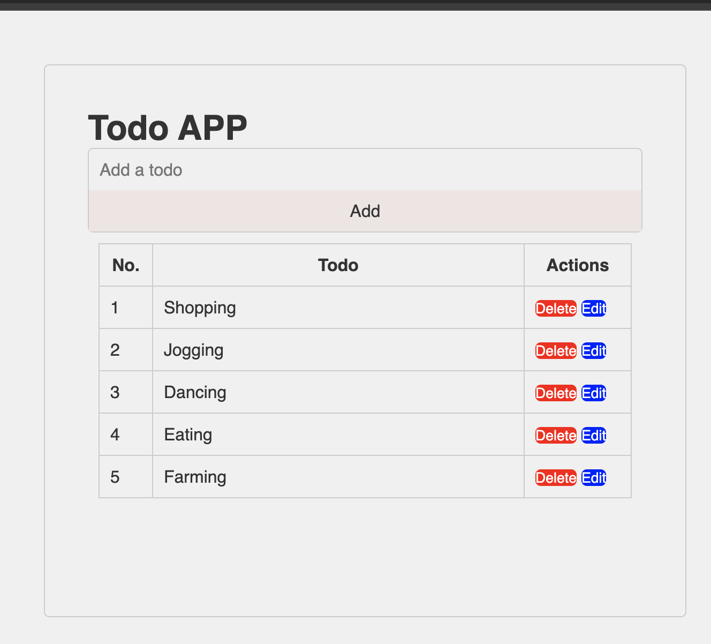

# Todo App

A simple web-based todo list application built with HTML, CSS, and vanilla JavaScript.
## Screenshot

## Features

- Add new todos with text input
- Delete existing todos
- Automatic numbering of todos
- Confirmation before deletion
- Responsive design
- Enter key support for quick todo addition
- Input validation to prevent empty todos

## Technologies Used

- HTML5
- CSS3
- Vanilla JavaScript
- Edit existing todos
- First letter capitalization for todos
- "No todos yet" message when list is empty

## How It Works

The app uses a simple array to store todos in memory. Key functions include:

- `addTodo()` - Adds new todos to the array and rerenders
- `deleteTodo()` - Removes todos with confirmation
- `editTodo()` - Allows editing existing todos with prompt
- `renderTodos()` - Dynamically updates the todo list display
- `capitalize()` - Ensures consistent capitalization

## Usage

1. Enter your todo item in the text input field
2. Click "Add" button or press Enter to add the todo
3. To edit a todo, click the "Edit" button and enter the new text
4. To delete a todo, click the "Delete" button next to it and confirm
5. Todos are numbered automatically and first letter is capitalized
6. Empty todos are not allowed

## Structure

- `index.html` - Main HTML structure and layout
- `style.css` - Styling and responsive design
- `script.js` - Application logic and functionality

## Styling

- Clean and minimalist design
- Responsive container width (600px)
- Hover effects on buttons and inputs
- Table-based todo list layout
- Word-break support for long todos

## JavaScript Features

- Window onload focus on input
- Event listeners for button clicks and keyboard input
- Dynamic rendering of todo list
- Array-based todo storage
- Confirmation dialogs for deletions
